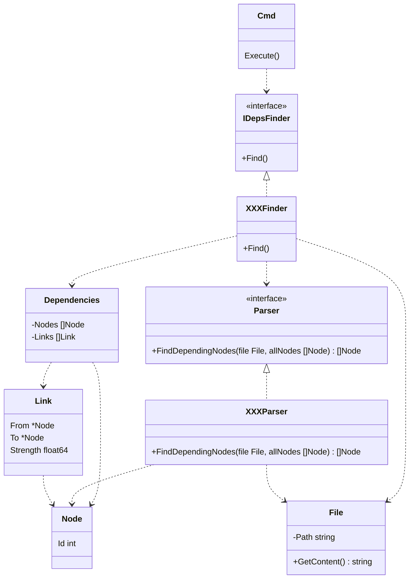

# デザイン

```mermaid
classDiagram
    class Cmd{
        Execute()
    }
    Cmd..>IDepsFinder

    class IDepsFinder {
        <<interface>>
        +Find()
    }
    class XXXFinder{
        +Find()
    }
    IDepsFinder<|..XXXFinder
    XXXFinder..>Parser
    XXXFinder..>Dependencies
    
    class Dependencies{
        -Nodes []Node
        -Links []Link
    }
    Dependencies..>Node
    Dependencies..>Link
    
    class File{
        -Path string
        +GetContent() string
    }
    XXXFinder..>File
    
    class Parser{
        <<interface>>
        +FindDependingNodes(file File, allNodes []Node) []Node
    }
    class XXXParser{
        +FindDependingNodes(file File, allNodes []Node) []Node
    }
    Parser<|..XXXParser
    XXXParser..>Node
    XXXParser..>File
    
    class Node{
        Id int
    }
    class Link{
        From *Node
        To *Node
        Strength float64
    }
    Link..>Node
```